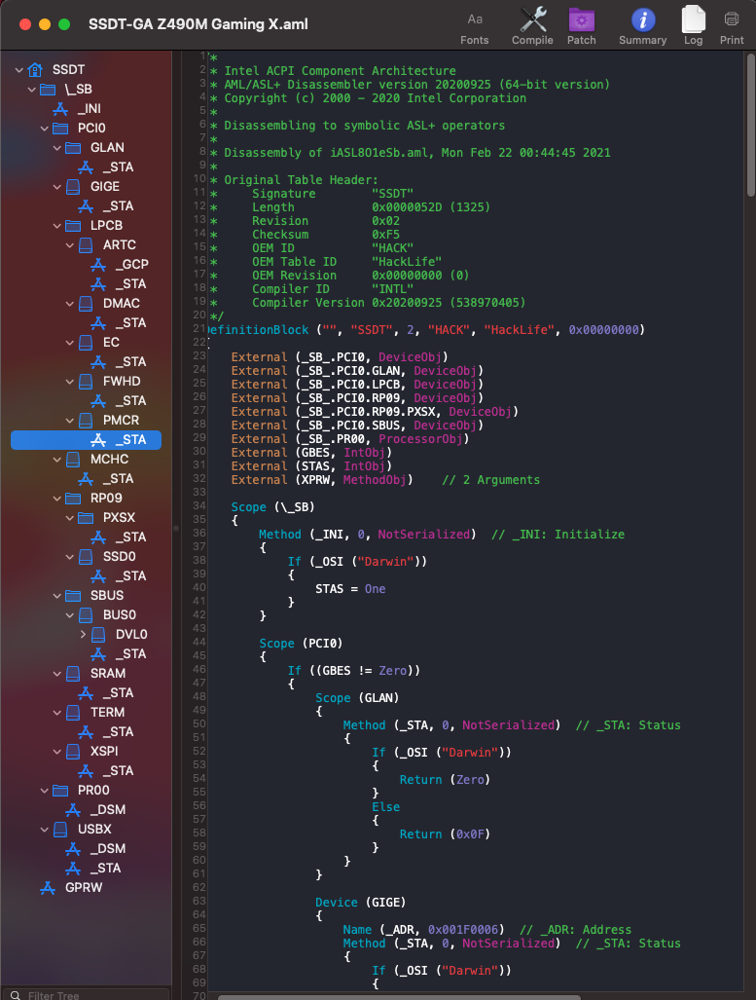
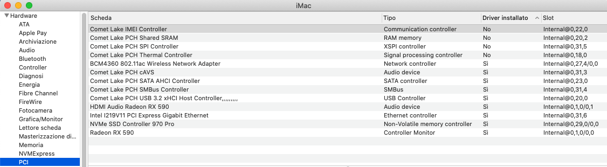
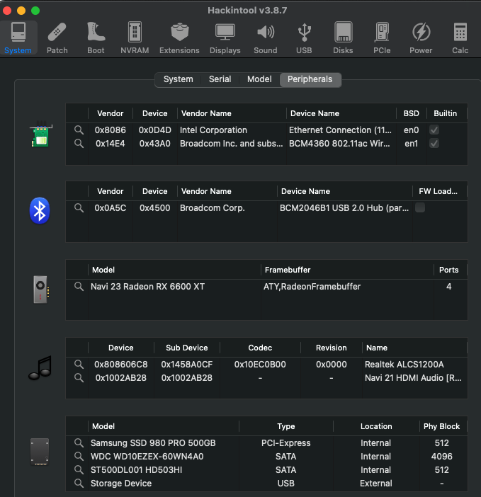
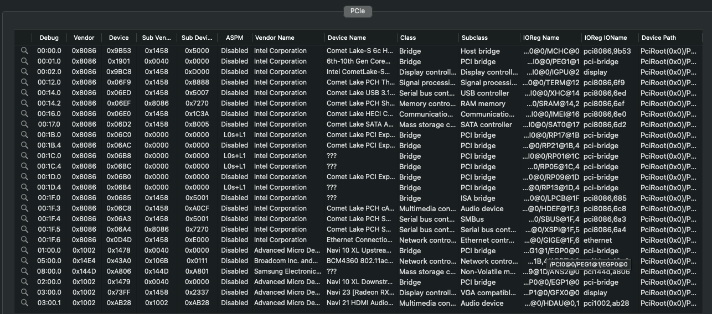

# OpenCore DELL Inspiron 5584

### Computer Spec:

| Component        | Brank                              |
| ---------------- | ---------------------------------- |
| CPU              | Intel i5 8265U                     |
| iGPU             | Intel® UHD Graphics 620            |
| Display          | 1920x1080                          |
| Audio            | Realtek ALC236                     |
| Ram              | 8Gb ddr4 2400 Mhz                  |
| Wifi + Bluetooth | BCM943602BAED                      |
| NVMe             | Samsung 970 evo plus 512Gb         |
| SSD              | Kingston A400 512gb                |
| SmBios           | MacbookPro 15,2                    |
| BootLoader       | OpenCore                           |

  

## DPCIManager Screenshot

### What works and What doesn't or WIP:

- [x] Intel UHD 620 iGPU eDP Output (with Backlight)
- [x] Intel UHD 620 iGPU HDMI Output
- [x] ALC236 Internal Speakers
- [x] ALC236 Native Combojack headphones
- [x] ALC236 HDMI Audio Output
- [x] All USB Ports 
- [x] SpeedStep / Sleep / Wake
- [x] I2C Touchpad with gesture
- [x] Brightness Key
- [x] Wi-Fi and Bluetooth BCM943602BAED Module
- [x] Realtek RTL8100 LAN
- [x] USB Cardreader
- [x] ACPI Battery
- [x] NVRAM
- [x] Windows boot from OpenCore

### Special Config:

- Usb port mapping performed
- Disabled unused device
- Cosmetics DSM in Configplist

## Info Section Screenshot

## Info Section SSDT Inspiron 5584

## Credits

- [Acidanthera](https://github.com/acidanthera) for OpenCore and all the lovely hackintosh work.
- [Apple](https://apple.com) for macOS;
- [daliansky](https://github.com/daliansky)
- [Dortiana](https://github.com/dortania)
- [Hackintoshlifeit](https://github.com/Hackintoshlifeit)
- [mald0n](https://github.com/MaLd0n)
- [rehabman](https://github.com/RehabMan)

# If you need help please contact us on [Telegram](https://t.me/HackintoshLife_it) or [Web](https://www.hackintoshlife.it/)
