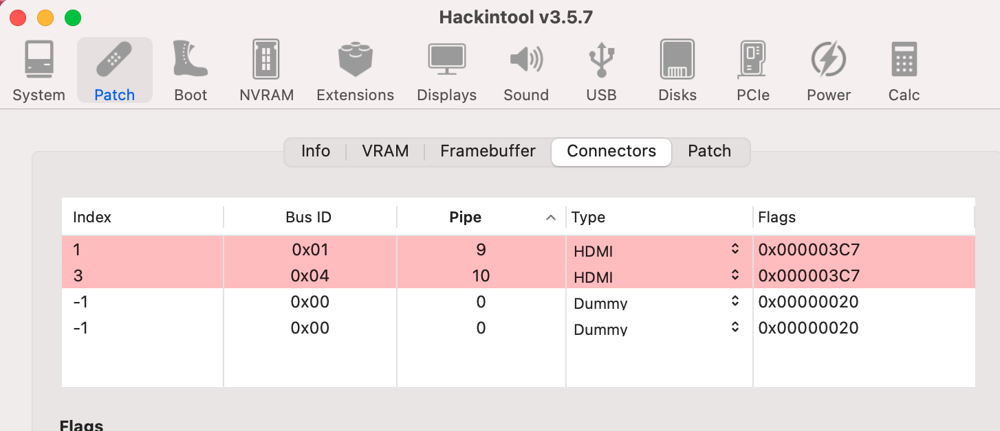
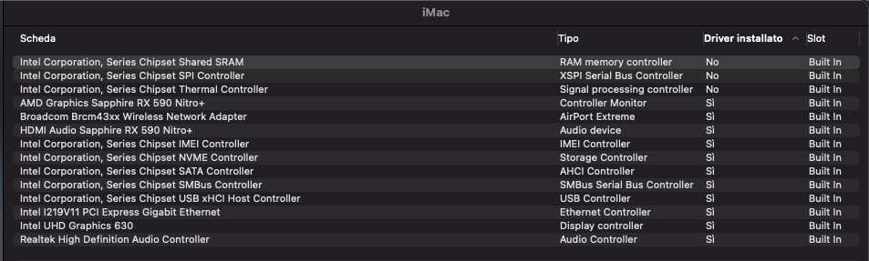
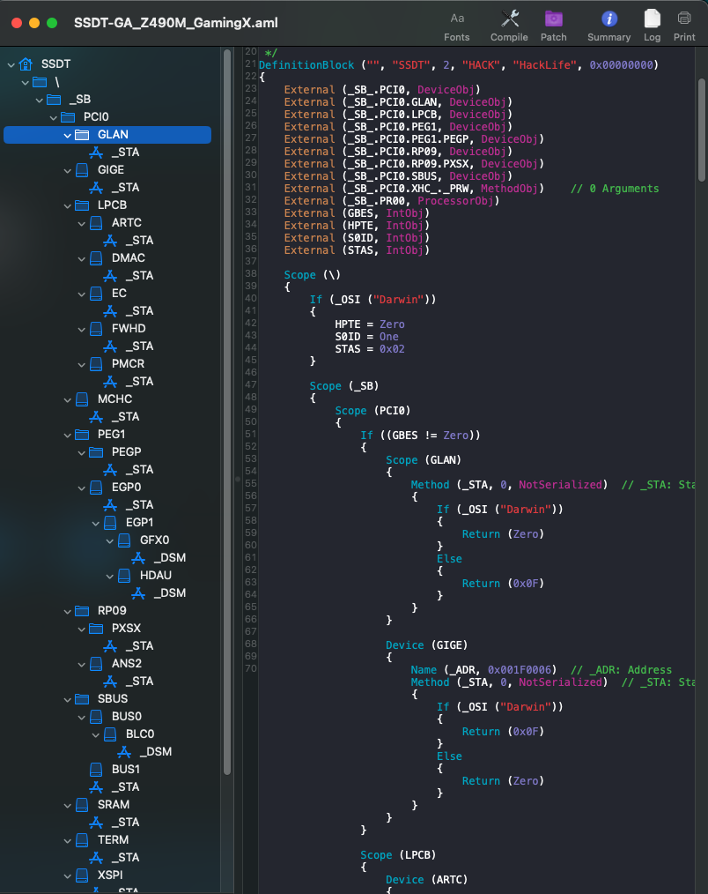

### Computer Spec:
| Component        | Brank                              |
| ---------------- | ---------------------------------- |
| CPU              | Intel i5 10600                     |
| IGPU             | Intel® UHD Graphics 630            |
| GPU              | Sapphire RX 590 Nitro+             |
| Audio            | Realtek ALC1200                    |
| Ram              | 32 Gb DDR4 3200 Mhz                |
| Wifi + Bluetooth | BCM94360CS2                        |
| NVMe             | Samsung 970 Pro 512Gb              |
| SmBios           | IMac 20.1                          |
| BootLoader       | OpenCore                           |

## DPCIManager Screenshot

## Patch IGPU HDMI\DP Output

### What works and What doesn't or WIP:
- [x] Intel UHD 630 iGPU
- [x] ALC1200 Internal Speakers
- [x] ALC1200 HDMI Audio Output
- [x] All USB Ports 
- [x] Wi-Fi and Bluetooth BCM94360CS2 Module
- [x] Intel (11)I219-V LAN
- [x] NVRAM
- [x] Windows boot from OpenCore

## USB Map by Hackintool
- Usb port mapping performed

- Disabled unused device
- Cosmetics DSM in Configplist

## Info Section SSDT GA Z490M Gaming X

## Credits

- [Acidanthera](https://github.com/acidanthera) for OpenCore and all the lovely hackintosh work.
- [Apple](https://apple.com) for macOS;
- [daliansky](https://github.com/daliansky)
- [Dortiana](https://github.com/dortania)
- [Hackintoshlifeit](https://github.com/Hackintoshlifeit)
- [mald0n](https://github.com/MaLd0n)
- [rehabman](https://github.com/RehabMan)

# If you need help please contact us on [Telegram](https://t.me/HackintoshLife_it) or [Web](https://www.hackintoshlife.it/)
