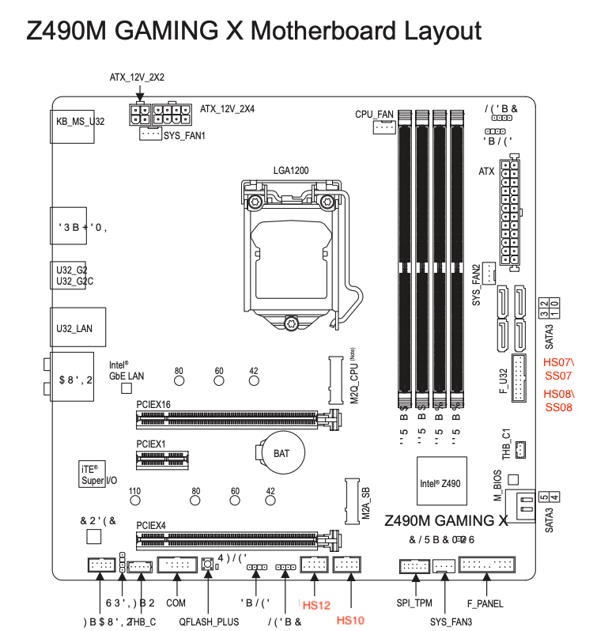

### Computer Spec:

| Component        | Brank                              |
| ---------------- | ---------------------------------- |
| CPU              | Intel i5 10600                     |
| iGPU             | Intel® UHD Graphics 630            |
| Audio            | Realtek ALC1200                    |
| Ram              | 8Gb x4 ddr4 3200 Mhz               |
| Wifi + Bluetooth | BCM94360CS2.                       |
| NVMe             | Samsung 970 Pro 512Gb              |
| SmBios           | IMac 20.1.                         |
| BootLoader       | OpenCore                           |

## USB Map by Hackintool

 

## DPCIManager Screenshot

### What works and What doesn't or WIP:

- [x] Intel UHD 630 iGPU eDP Output (with Backlight)
- [x] Intel UHD 630 iGPU HDMI Output
- [x] ALC1200 Internal Speakers
- [x] ALC1200 HDMI Audio Output
- [x] All USB Ports 
- [x] SpeedStep / Sleep / Wake
- [x] Wi-Fi and Bluetooth BCM94360CS2 Module
- [x] Intel (11)I219-V LAN
- [x] USB Cardreader
- [x] NVRAM
- [x] Windows boot from OpenCore

### Special Config:

- Usb port mapping performed
- Disabled unused device
- Cosmetics DSM in Configplist

## Info Section Screenshot

## Info Section SSDT Inspiron 5584

## Credits

- [Acidanthera](https://github.com/acidanthera) for OpenCore and all the lovely hackintosh work.
- [Apple](https://apple.com) for macOS;
- [daliansky](https://github.com/daliansky)
- [Dortiana](https://github.com/dortania)
- [Hackintoshlifeit](https://github.com/Hackintoshlifeit)
- [mald0n](https://github.com/MaLd0n)
- [rehabman](https://github.com/RehabMan)

# If you need help please contact us on [Telegram](https://t.me/HackintoshLife_it) or [Web](https://www.hackintoshlife.it/)
